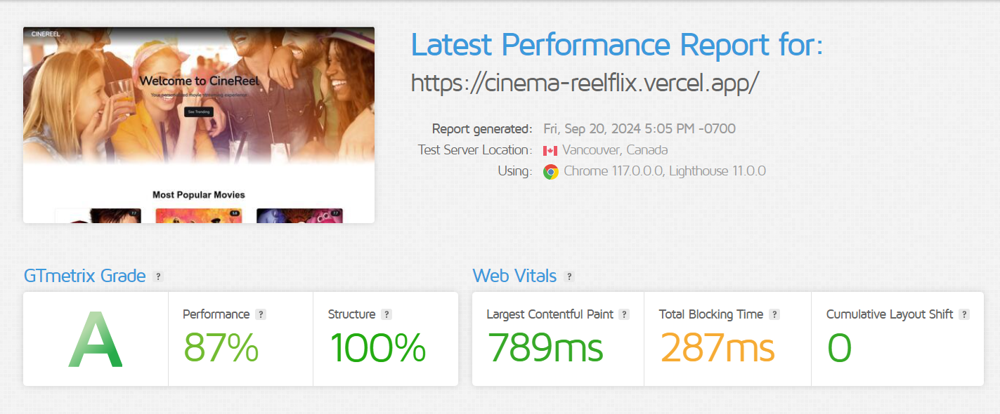
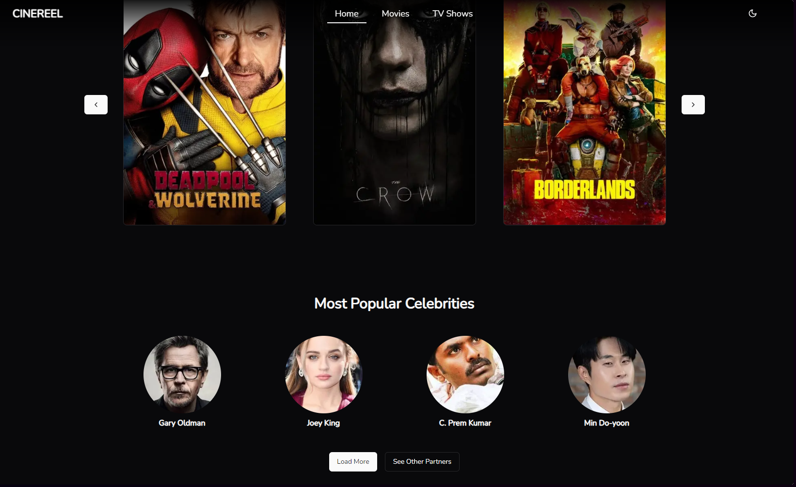
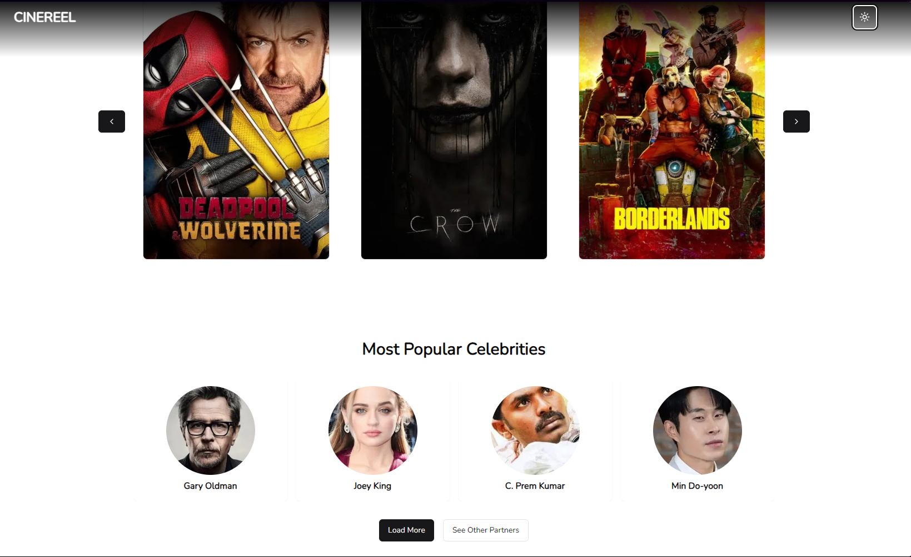

# Cinereel App

A modern, responsive web application for browsing movies and TV shows, built with Next.js 14, React, and Tailwind CSS.

## Features

- Cross platform
- Light/dark mode toggle
- Browse popular movies and TV shows
- Animated UI elements using Framer Motion
- Google tag manager and analytics inclusion.
- Responsive design with mobile-friendly navigation
- View detailed information about movies and TV shows
- Server-side rendering for improved performance and SEO


## Tech Stack

 Next JS 14, Typescript, TailwindCSS, Shadcn, Framer-motion, Anime JS


## Installation

Clone the project

```bash
  https://github.com/Xanderyeng/cinereel.git
```

Go to the project directory

```bash
  cd cinereel
```

Install dependencies

```bash
  npm install
```
or
```bash
  bun install
   ```
   or
   ```
   yarn install
   ```
    
## Environment Variables

To run this project, you will need to add the following environment variables to your `.env.local` file

```
   TMDB_API_KEY=your_tmdb_api_key
   ```
   Remember to create an account on Google cloud console and obtain a google tag manager ID.
   ```
   GOOGLE_TAG_ID


## Run Locally

Start the development server

```bash
  bun run dev
```
or
```bash
  npm run dev
```


## Launch browser
Open [http://localhost:3000](http://localhost:3000) in your browser to see the app.
## Deployment
This app can be easily deployed to Vercel or any other Next.js-compatible hosting platform.
## Contributing

Contributions are welcome!
Please feel free to submit a Pull Request.


## License

[MIT](https://choosealicense.com/licenses/mit/)


## Badges

Add badges from somewhere like: [shields.io](https://shields.io/)

[](https://choosealicense.com/licenses/mit/)
[](http://www.gnu.org/licenses/agpl-3.0)
[](https://opensource.org/licenses/)


## Screenshots







